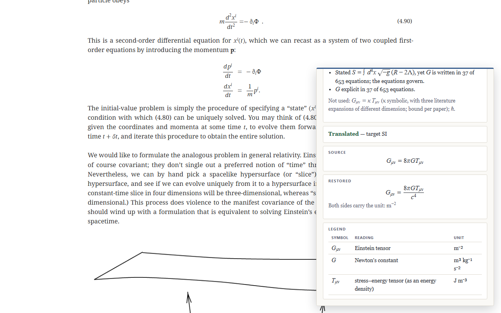
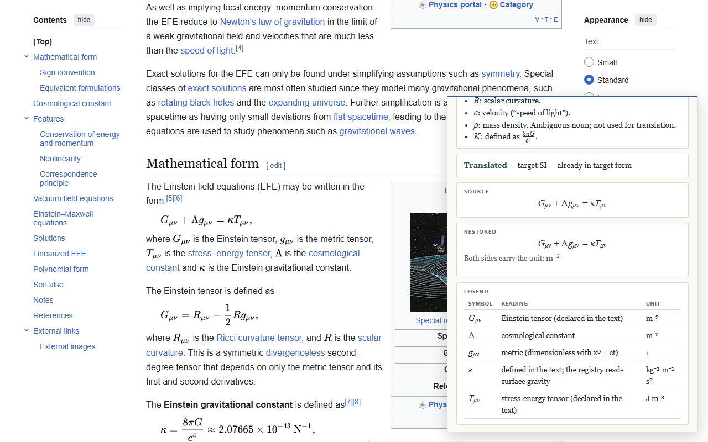

# restitutor

[](https://github.com/realkss/restitutor/actions/workflows/ci.yml)
[](https://github.com/realkss/restitutor/releases/latest)
[](LICENSE)



Restore, strip, and check the physical constants in equations. A deterministic engine that translates between unit conventions (geometrized, SI, CGS-Gaussian, Heaviside–Lorentz) and a browser extension that does it in place on the physics pages you read, with one contract it never breaks:

**Lookup, never inference.** Every symbol resolves through a registry of readings; the missing powers of the constants are the *unique* solution of a dimensional linear system (no combination cᵃGᵇ is dimensionless, so uniqueness is a theorem, not a heuristic). Anything unknown, unsupported, or inconsistent **declines loudly**, with the offending symbol or term named. It never guesses silently.

## What it does

A general-relativity page prints the field equations in geometrized units:

$$G_{ab} + \Lambda g_{ab} = 8\pi T_{ab}$$

One click, target SI, and the engine returns

$$G_{ab} + \Lambda g_{ab} = \frac{8\pi G\,T_{ab}}{c^{4}}$$

with the legend it used, every entry a registry lookup:

| Symbol | Reading | Unit |
| --- | --- | --- |
| $G_{ab}$ | Einstein tensor | m⁻² |
| $\Lambda$ | cosmological constant | m⁻² |
| $g_{ab}$ | metric (dimensionless with $x^0 = ct$) | 1 |
| $T_{ab}$ | stress–energy tensor (as an energy density) | J m⁻³ |

The same click on $r_s = 2M$ gives $r_s = 2GM/c^{2}$. Where the registry cannot vouch for an equation, nothing is produced and the reason is stated:

| Equation | Verdict |
| --- | --- |
| $S = A/4$ | Declined: temperature dimensions that do not balance; this hub keeps $k_B$ explicit and only reinserts $c$ and $G$. |
| $\psi_4 = \chi\,\Xi^{ab}\,T_{ab}$ | Declined: a term admitting no c–G completion; unknown symbols $\psi_4$, $\chi$, $\Xi^{ab}$. |
| $\mathrm{SL}(2,\mathbb{R})$ | Refused: a named mathematical object, not an equation. |

Beside the translation, the extension reads what the page itself says about its conventions and reports the **set** of conventions consistent with all of it, never a single guess. On a page that states "we use geometrized units, G = c = 1" and prints the equation above, the verdict is *consistent with 7 of 36*, with three lines of evidence: the declaration chain, the named system, and the equation's own form (8π and no G). Declarations are intersected, printed constants exclude, absence is never evidence, and a body that prints a constant its own chain claims to have absorbed is reported as a contradiction rather than resolved.

Three more things are read off the page and shown in the panel:

- **Declared symbols** (census §6.5). "Where Σ is the surface density" extends the registry for that page, and the legend says so; where the page's reading disagrees with the registry's, the clash is shown. A reading whose dimension the text has not pinned down (an E&M quantity with no named system, a metric with no coordinate convention, an ambiguous noun) is shown with its caveat and kept out of the registry.
- **Defined symbols.** "κ = 8πG/c⁴", in prose or as a display equation, gives κ the expression's dimension, computed by the engine, so the field equation written with κ translates too. Only an expression built from constants counts: a relation among the page's variables holds in the page's convention, not in SI, and is never read as a dimension.
- **Dimensionless forks** (census §5). Places where a dimension check passes and the number is still wrong (the reduced versus unreduced Planck mass, α = e²/4π versus e², the Fourier kernel, the ½ on a trace norm) are recovered from the printed form, 40 verified rules today; a page where none is recoverable is reported as negative evidence, not defaulted.

On Wikipedia's field-equations article, whose κ the page defines as 8πG/c⁴, the panel reads the definition and reports the equation as already in SI form:



Everything runs locally. No network requests, no accounts, no data collection ([privacy policy](docs/privacy.md)).

## Install

**Browser extension (Chrome and Chromium browsers such as Edge and Brave).** Download `restitutor-<version>.zip` from the [latest release](https://github.com/realkss/restitutor/releases/latest), unzip it, open `chrome://extensions`, turn on Developer mode, choose *Load unpacked*, and pick the unzipped folder. It runs on ar5iv, arXiv HTML, and every Wikipedia; click any equation. A Chrome Web Store listing is in preparation ([listing copy](docs/store-listing.md)).

**From source.**

```bash
npm ci
npm test            # the suite
npm run build:ext   # extension/dist/ — the load-unpacked directory
npm run build:app   # app/dist/ — the paste-box app; then serve app/ statically
npm run package:ext # release/restitutor-<version>.zip
```

**As a library.** The engine is one dependency-free file. KaTeX is injected by the caller:

```ts
import katex from "katex"
import { findRegistryForSlug, translateTex } from "./src/unitsEngine"

const registry = findRegistryForSlug("Topics/Physics/Relativity-and-Gravitation/")!
const result = translateTex("r_s = 2M", katex, registry, { system: "si", geometrized: false })
// result.kind === "translated", result.restoredTex === "r_{s} = \\frac{2GM}{c^{2}}"
```

## What is and is not there

| | Today |
| --- | --- |
| Translation | The general-relativity profile: a registry of GR readings whose source convention is geometrized (G = c = 1, ħ and k_B kept explicit), translated into six targets: SI, Gaussian, or Heaviside–Lorentz, each with c and G restored or stripped. |
| Detection | Document- and section-level detection over 36 conventions: declaration chains, named systems, 22 equation-form fingerprints, the Einstein-prefactor ladder, visible constants, 38 code identities, 40 dimensionless-fork rules. |
| Pages | Math whose TeX the page carries: `<math alttext>` (LaTeXML: ar5iv, arXiv HTML, Wikipedia in any language, including right-to-left ones), KaTeX's `x-tex` annotation, MathJax v2's `math/tex` script. MathJax v3 pages carry no TeX and are marked, not clickable. |
| Declines | Unknown symbols, terms with no c–G completion, temperature dimensions the profile keeps explicit (k_B is never reinserted), named mathematical objects, sets and maps, TeX that does not parse. Every decline names its reason. |
| Not there | Other profiles (natural units, atomic units, cosmology): profiles are corpus-driven and none but GR has been built. PDFs and OCR. Anything that infers a reading rather than looking it up. |

The domain specification is the [unit-systems census](docs/unit-systems-census.md), five adjudicated rounds over the literature, with its evidence base in `docs/data/` (the fingerprint, glossary, code, and fork tables the runtime is generated from; the mined benchmark seed; the executed prototype). The [product design](docs/product-design.md) records the architecture, the staging, and the trust boundary that any future context reader would have to pass.

## Layout

- `src/unitsEngine.ts` — the DOM-free engine plus the GR registry. KaTeX is dependency-injected by the caller; this file imports nothing. Frozen: [the site it was extracted from](https://hypomnemata-b8t.pages.dev/en/Topics/Physics/Relativity-and-Gravitation/00.-Conventions-and-Notation), where it runs as the units-translation floater, vendors it byte-identical.
- `src/convention.ts`, `src/rendering.ts` — the generator-parameterized convention layer (census §2): 36 conventions as data over exact rational dimension vectors, validation with named implied groups, the restoration solve, and the rider tables under the span rule.
- `src/signs.ts`, `src/identity.ts` — the sign-convention axis (signature translation, Levi-Civita typing) and the open identity-metadata tag vector with its combinability lint.
- `src/converter.ts`, `src/contract.ts` — the numeric equivalence graph (SI-2019 exact constants, one reciprocal edge with a mandatory medium tag) and the unit-contract prefactor detector.
- `src/detect.ts`, `src/forks.ts`, `src/mine.ts`, `src/gate.ts` — census §6: document- and span-level detection, fork recovery, the declaration miner, and the refusal of named objects.
- `src/bridge.ts`, `src/profiles.ts` — the engine ↔ convention-layer bridge, the trust boundary (`registryTrusts`) every page-contributed reading passes, and the corpus-driven profile mounting point.
- `src/tables.generated.ts` — generated from `docs/data/*.json` by `npm run gen:tables`; never edited by hand.
- `src/*.test.ts` — the suite (`npm test`), including the mutation-testing survivors pinned as tests.
- `app/` — the stage-1 paste box over the engine. `app/fixtures/stage2.html` exercises the extension's content script in a plain tab.
- `extension/` — the stage-2 browser extension (Manifest V3): a content script that finds math whose TeX the page carries and translates it on click in an in-page panel, with the extraction provenance shown. `extension/src/page.ts` reads the page — spans, the miner's surface, the page's readings — against the standard DOM only, so the same code runs in the browser and in node.
- `test/fixtures/wikipedia/` — two Wikipedia articles as served (CC BY-SA, see the README there). `extension/src/page.real.test.ts` runs the whole page reading over them in node and pins what the browser shows on those pages; `scripts/verify-live.py` does the same inside headless Edge on a live page, with the panel rendered.
- `docs/` — the census, the product design, the store listing, the privacy policy; `docs/data/` the evidence base.
- `scripts/` — the builds, the table generator, the store packager, and `check-site-sync.mjs` (`npm run sync-check`), which verifies the site's vendored engine is identical to `src/` up to line endings and BOM. This repository is the source of record.

## Toolchain notes

KaTeX is pinned **exactly** (`0.16.47`). The engine consumes KaTeX parse trees, and a patch-level bump has broken AST consumers before while every equation still rendered. Treat any KaTeX version change as an engine change, run the suite, and keep the site's vendored KaTeX on the same pin.

Line endings: the repository is LF; the generated table is regenerated in CI and must match the committed file byte for byte.

## License

MIT — see [LICENSE](LICENSE).
